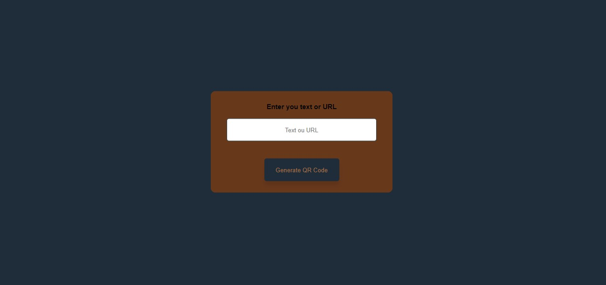

<h1 align="center"><a href="https://gustavo-freita.github.io/QR-Code-Generator/">QR Code Generator</a></h1>

## Descrição do Projeto:

Esse projeto foi criado com o objetivo de me ajudar a desenvolver QR codes para projetos pessoais. Invés se usar um online eu acabei criando um para consumo próprio, já que eu tinha em mente como um projeto para fazer de criação de QR codes.

## Project Description:

This project was created to help me develop QR codes for personal projects. Instead of using an online QR code generator I ended up creating one for myself.

<h2 align="center">

</h2>

<h3 align="center">
  
  
</h3>

### 🛠 Tecnologias / Technologies

As seguintes ferramentas foram usadas na construção do projeto / The following tools were used in building the project:

- [HTML](https://www.w3schools.com/html/)
- [CSS](https://www.w3schools.com/Css/)
- [JavaScript](https://developer.mozilla.org/en-US/docs/web/javascript/guide/introduction)
- [QRcodeAPI](https://goqr.me/api/)

<h2>:hammer: Créditos</h2>
Web Page feito por / Web Page made by:

<a href="https://github.com/gustavo-freita">Gustavo Freitas</a> <a href="https://github.com/gustavo-freita">
